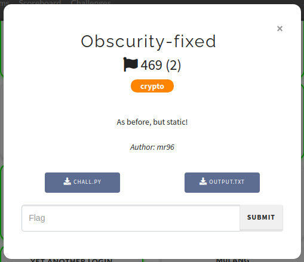
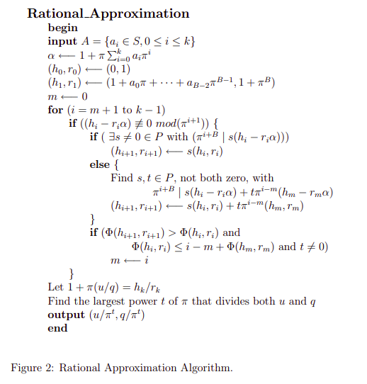
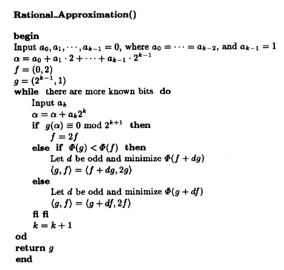

## Challenge information



## Files

### **chall.py**

```python
import random
from functools import reduce
from secret import flag

def xor(a, b):
    return bytes(x^y for x,y in zip(a,b))

class LFSR(object):
    def __init__(self, s, p):
        self.s = s
        self.p = p

    def clock(self):
        out = self.s[0]
        self.s = self.s[1:]+[self.s[0]^self.s[(self.p)[0]]^self.s[(self.p)[1]]]
        return out

def buildLFSR(l):
    return LFSR([int(x) for x in list(bin(random.randint(1,2**l-1))[2:].rjust(l,'0'))], random.sample(range(1,l), k=2))

pt = "Look, a new flag: " + flag
pt = pt.encode()

lfsr_len = [random.randint(4,6) for _ in range(random.randint(9,12))]
L = [buildLFSR(i) for i in lfsr_len]
u = 0
key = b""
for i in range(len(pt)):
    ch = 0
    for j in range(8):
        outvec = [l.clock() for l in L]
        out = (reduce(lambda i, j: i^j, outvec) ^ u) & 1
        u = (u+sum(outvec))//2
        ch += out*pow(2,7-j)
    key += bytes([ch])

res = xor(key,pt).hex()
print(res)
```

### **output.txt**

```
d51664d413ba62984baf680bf98d9cf797f6da473adb19cd041220ae25cc0a9e7cdce8588f26862cc2d270d9373c17db678d69ffb4280371927cf9144c0bbd526c721d54c3c8f1de1f3fa6e5c84ece35c1
```

## Solution

**The second variant of the challenge. The unintended solution was fixed.**

Ok, now it became harder. First we notice that we've got only a short known plaitext of length 22 (`ptm{` is a flag format):

```
Look, a new flag: ptm{
```

The stream cipher looks like a combination of a few [LFSR ciphers](https://en.wikipedia.org/wiki/Linear-feedback_shift_register). It's a well-known fact that the LFSR polynomial can be reconstructed with [Berlekamp–Massey algorithm](https://en.wikipedia.org/wiki/Berlekamp–Massey_algorithm), and the combination of LFSRs can be represented as the single one LFSR. So we could try to run `berlekamp_massey` on the keystream, but it will fail.

If we look at the code closely, we will notice the small variable `u` which affects the output bits. It depends on the LFSRs output and changes on the every bit:

```python
u = (u+sum(outvec))//2
```

It looks like something like a _carry_! And we're catching a flashback immediately: this is a [FCSR cipher](https://en.wikipedia.org/wiki/Feedback_with_Carry_Shift_Registers).

After some searching we can find a paper [Register Synthesis for Algebraic Feedback Shift
Registers Based on Non-Primes](http://cs.engr.uky.edu/~klapper/pdf/nfcsr.pdf) by Andrew Klapper and Jinzhong Xu. It suggests an algorithm to reconstruct the FCSR:



It requires operation with [p-adic numbers](https://en.wikipedia.org/wiki/P-adic_number). So I thought it's too tricky to implement and found another paper [Cryptanalysis Based on 2-Adic Rational Approximation](https://link.springer.com/content/pdf/10.1007%2F3-540-44750-4_21.pdf) by Andrew Klapper and Mark Goresky. Their algorithm works with `2-adic` numbers, that is ordinary numbers built from bits:



Looks easy to implement, so let's do it! I will use `sage`:

```python
def algorithm(stream):
    a = [None] * (len(stream) + 1)
    k = 1

    a[k - 1] = 1
    alpha = a[k - 1] * 2^(k - 1)

    f = (0, 2)
    g = (2^(k - 1), 1)

    def func(h):
        return alpha * h[1] - h[0]

    def add(x, y):
        return (x[0] + y[0], x[1] + y[1])

    def multiply(x, y):
        return (x[0] * y, x[1] * y)

    def big_f(x):
        return max(abs(x[0]), abs(x[1]))

    def find_d(func):
        min_d, min_result = None, 1 << 1024

        for d in range(-10001, 10001 + 1, 2):
            if d == 0:
                continue

            result = func(d)

            if abs(result) < min_result:
                min_d, min_result = d, abs(result)

        return min_d

    for bit in stream:
        a[k] = bit
        alpha += a[k] * 2^k

        if func(g) % (2^(k + 1)) == 0:
            f = multiply(f, 2)
        elif big_f(g) < big_f(f):
            d = find_d(lambda d: big_f(add(f, multiply(g, d))))
            g, f = add(f, multiply(g, d)), multiply(g, 2)
        else:
            d = find_d(lambda d: big_f(add(g, multiply(f, d))))
            g, f = add(g, multiply(f, d)), multiply(f, 2)

        k += 1

    return g
```

For the given keystream it returns

```
(-6658610176590470404853021, 1036253257551142714799835)
```

Now we need to reconstruct FCSR using p-adic numbers divison. Example script:

```python
plaintext = b'Look, a new flag: ptm{'
ciphertext = bytes.fromhex('d51664d413ba62984baf680bf98d9cf797f6da473adb19cd041220ae25cc0a9e7cdce8588f26862cc2d270d9373c17db678d69ffb4280371927cf9144c0bbd526c721d54c3c8f1de1f3fa6e5c84ece35c1')

pt_bits = bytes_to_bits(plaintext)
ct_bits = bytes_to_bits(ciphertext)

keystream = xor_bits(pt_bits, ct_bits)

u, v = algorithm(keystream)

precision = len(ct_bits) + 1
Z = Zp(2, prec=precision)
approximation = Z(u) / Z(v)
key_bits = [int(approximation[i]) for i in range(precision)]

flag = xor_bits(key_bits[1:], ct_bits)
print(bits_to_bytes(flag))
```

## Flag

```
Look, a new flag: ptm{n0w_r3p0r7_7h3_53c0nd_un1n73nd3d_70_@mr96_1cdf85df0860893c}
```
