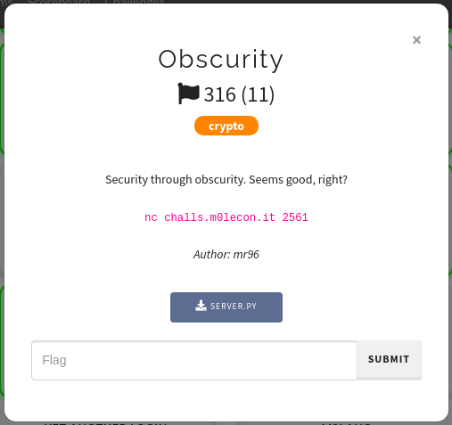

# m0leCon CTF 2021 Teaser — Obscurity

## Challenge information



## Files

### **server.py**

```python
import random
from functools import reduce
import sys
from math import log2
from secret import flag

def xor(a, b):
    return bytes(x^y for x,y in zip(a,b))

class LFSR(object):
    def __init__(self, s, p):
        self.s = s
        self.p = p

    def clock(self):
        out = self.s[0]
        self.s = self.s[1:]+[self.s[0]^self.s[(self.p)[0]]^self.s[(self.p)[1]]]
        return out

def buildLFSR(l):
    return LFSR([int(x) for x in list(bin(random.randint(1,2**l-1))[2:].rjust(l,'0'))], random.sample(range(1,l), k=2))

key = b""

print("encrypt plz [in hex]")
pt = bytes.fromhex(input().strip())

if len(pt)>1000:
    print("WELL, not that much")
    exit()

pt = pt + flag
periodic = True

while periodic:
    lfsr_len = [random.randint(4,6) for _ in range(random.randint(9,12))]
    L = [buildLFSR(i) for i in lfsr_len]
    u = 0
    key = b""
    for i in range(len(pt)+65):
        ch = 0
        for j in range(8):
            outvec = [l.clock() for l in L]
            u = (u+sum(outvec))//2
            out = (reduce(lambda i, j: i^j, outvec) ^ u) & 1
            ch += out*pow(2,7-j)
        key += bytes([ch])
    kk = key.hex()
    if kk.count(kk[-6:]) == 1:
        periodic = False

res = xor(key[:-65],pt).hex()
print(res)
```

## Solution

**The first variant of the challenge. It has a bug, which leads to an unintended solution. I will describe it briefly.**

So, here is an encryption server. It reads some data from user and XORs `(data + flag)` with some keystream. The data length is limited by 1000 bytes. Obviously, we don't want to waste our time to XOR it backward, so we will send only zero bytes. We won't look at the keystream generation, let's just try to encrypt something.

Our goal is to find a period of the keystream. The server code checks it, but it does it wrong. We will enumerate all keystream suffixes from longest to shortest and count its occurrences:

```python
# send the plaintext to the server and read ciphertext
def encrypt_data(plaintext):
    ...
    return ciphertext

plaintext = b'\x00' * 1000
ciphertext = encrypt_data(plaintext)
keystream = bytes_to_bit_string(ciphertext[:1000])

for start in range(1, len(keystream)):
    suffix = keystream[start:]

    if keystream.count(suffix) > 1:
        print(keystream.replace(suffix, '_' * len(suffix)))
        break
```

Run this code several times and see the occurence:

```
10______________________________________________________________________________________________________________________________________________________________________________________________________________________________________________________________________________________________________________________________________________________________________________________________________________
________________________________________________________________________________________________________________________________________________________________________________________________________________________________________________________________________________________________________________________________________________________________________________________________________________
________________________________________________________________________________________________________________________________________________________________________________________________________________________________________________________________________________________________________________________________________________________________________________________________________________
__________________________________________________________________________________________________________________________________________________________________________________________________________________________________________________________________________________________________10011000011101110111110011011101111001010011111000011000101111110010011101100010000111010010000000011100100010
0010011011010111101110101110111100111100010010010110100111110010101001010111111010000101001100100011111100000101110001101110110110101010110101100110000010011011001010110111110011000101110100000100010111011110100010011011010101111110100111011001110000010101010010100011001110001000010111011000000111010010110001111110010000110100111000110011001010000101000100100100001011111010101010111100101111110110
0101000001010010101010110110100101011101111100110111001011000000110101100000010000101000010001111000100101100101011010011111100000011111011000100101001011101101011011111101000110011101001100101100000001110111001001000011010000111000110011110001011011101101101101010000010111010101000000111101100100000111110110110001110111110010010110000101010111010011101101010110110001011101111001100110011111011100
1111100000110110100011000011010101101010001001011011111111111110011001010011010001101001101000001110111010100000110111110001011101111110000111100000001011110010100101011111001111010000111010011001101110100111011010000010110110110001010011111100101110101001011101001111101011001011110110110101000001100010010111001000000001011010110100010001110111100110111010011001010110111001011111101010010001010001
0110011011101100111111011010000101111110101000001101001010100110011110010011110010101010010110110001110000010100000101100111101000001110111011000100010110000001011100100001011101101010100111011110100101111110010100001011111100111110111000110100100000010000010011000000100110110010010111111100110110011001100100010010010011100011101111000001001001111000100111000010011001111110000111011101001000100101
1000101101010011000000000011011010001101111110000011011100101101000011110010001000100110100000011100101000100101011011001110010101001000011001100000010011010010110001100001111100011100001010010101011010101100001001111000011101000000000110111100000110111110101001010101101001011111010000101000100010000101010110111001100111011001011100110010000000111000100000000001110010010101110101001100011001000101
1001100100101011000111111011111001111000010001101110110011001110100100110011011011011101010110100000001011101001110001111110001011110110000000100001001000110111111000000000010111100001000000101111100111110010010011100110110011010100111010010100111001001001101011100011111111100110010111011011010001110010101111011001100000010110101010001011111111110111101101000001100111101100100000110110100100011001
1000010011100000000100011100101100100010111111110101011100110110101111001100010011111000100101110010000111111101011000101110011010010100011010100010011101111000110100010000000001100010001011000111111001000110000101000011110110000110011100101010000110000110000101010110110000011011011000101111101000100101011000000101000100101010101110001110010101010110100010011101100000010111000110011101101101000000
0010111010100001100111010100010111100011011111011010000000010100100100011011000101100111111110001000111100001001011110101100000001011000101001100111100111111101100001100111111011101100100101100010111000110000000001011010100011110111000110010101000001111110001110101001110101101101011001101001111011011110001101111100011011010100101000010111110000100010100010100101110110101001111111001000001100100000
0010001101101010000010111110100100011101100110000111001000010001000100010001011100011011011101011000011011101111100011011111101100111111110011010110111110101010001101111101110101111010001001110010100101001100110010100110111010010001010110100000001001001110101101110000111101000010100011011001101011000100101011010001100101110011001111101110010011010010000001110110101011000101100011011111101000001001
1101101101010110010000001111101010000000011111111001001110010001011001101010000000011001101000000100111010010101010110000100111101111101100110111001100100111010100110100111001010000010111110000100111110110010001101101000111100011110100001101010000010001111111110000110011000111000110000000011110101101000110100010111000100100100001110101010011000001110110010000101110110100001110100001110100001011010
0001110111101100000101011010000111100010100101110001100001000011111010000001010101110110111111000001101111011110101111100011110101100011000001000111010110000001111000000000001010101001000101111010101000110010100101011111101000100101001001001101110100101011011001101000000011111010000000000111101010011100100001101100011010101101011101100101010001100101110010011010001000111000111001010101001101011001
0100101011011000101100001101111010001101111010010001100000111000000100101110000101110110100000011001000000000111100010011111110110000010011110101110011010011001010010101110101001111111000010011111000011010011110110111010011101101001110111101010000001111010100001000101100000111101001110001100110101110100000101110000100011110010001001111111100010010000001010010001111000011001000111100011101010100010
0001110000100100011101001000110011011010110101111011110010011100101100011111010000000101101010100000111111101001________________________________________________________________________________________________________________________________________________________________________________________________________________________________________________________________________________________________
________________________________________________________________________________________________________________________________________________________________________________________________________________________________________________________________________________________________________________________________________________________________________________________________________________
________________________________________________________________________________________________________________________________________________________________________________________________________________________________________________________________________________________________________________________________________________________________________________________________________________
________________________________________________________________________________________________________________________________________________________________________________________________________________________________________________________________________________________________________________________________________________________________________________________________________________
```

**There are repeating bits!** It means that we can decrypt the flag easily: just xor it with some bits from the beginning of the keystream. Example:

```python
plaintext = b'\x00' * 1000
ciphertext = encrypt_data(plaintext)
keystream = bytes_to_bit_string(ciphertext[:1000])
encrypted_flag = bytes_to_bit_string(ciphertext[1000:])

for start in range(1, len(keystream)):
    suffix = keystream[start:]

    if keystream.count(suffix) > 1:
        index = keystream.find(suffix)
        key = keystream[index + len(suffix):]
        flag = xor_bit_strings(encrypted_flag, key)
        print(bit_string_to_bytes(flag))
```

After some tries the flag will be printed.

## Flag

```
ptm{pl3453_r3p0r7_y0ur_un1n73nd3d_70_@mr96}
```
