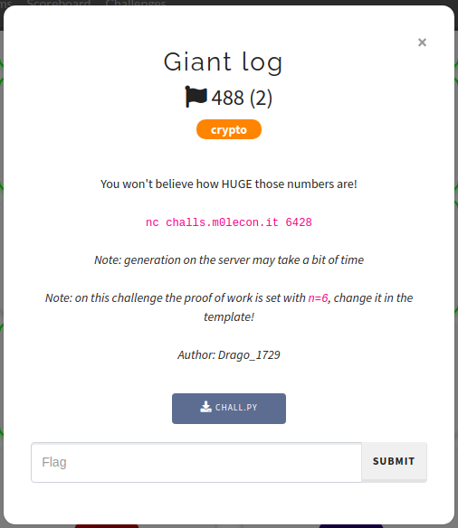

# m0leCon CTF 2021 Teaser — Giant log

## Challenge information



## Files

### **chall.py**:

```python
import random
from secret import flag, fast_exp
import signal

p = 0x83f39daf527c6cf6360999dc47c4f0944ca1a67858a11bd915ee337f8897f36eff98355d7c35c2accdf4555b03a9552b4bf400915320ccd0ba60b0cb7fcad723
g = 0x15a5f7dec38869e064dd933e23c64f785492854fbe8a6e919d991472ec68edf035eef8c15660d1f059ca1600ee99c7f91a760817d7a3619a3e93dd0162f7474bbf


def test():
    for _ in range(10):
        x = random.randint(1, p)
        n = random.randint(1, 20)
        m = p**n
        assert pow(g, x, m) == fast_exp(x, n)

def chall():
    n = 1000
    x = random.randint(1, p**(n-1))
    y = fast_exp(x, n)
    return x, y


def stop(signum, stack):
    print("Too slow")
    exit(1)


def main():
    x, y = chall()
    timeout = 60
    print(hex(y))
    print("Now gimme x")
    signal.alarm(timeout)
    x_inp = int(input(), 16)
    if x == x_inp:
        print("Wow, impressive!")
        print(flag)
    else:
        print("Nope, sorry")


if __name__ == "__main__":
    signal.signal(signal.SIGALRM, stop)
    #test()
    main()
```

## Solution

The main goal of the challenge is simple: we just need to calculate a [discrete logarithm](https://en.wikipedia.org/wiki/Discrete_logarithm) in _very huge_ numbers. The challenge server generates a random number `x ∈ [1, p]`, calculates `y = g ^ x (mod p^1000)` and prints `y`, then we need to find `x` in 60 seconds. It's obvious that running the discrete logarithm directly will be inefficient, so we need to use a different approach.

When you see a prime power (such as `p^1000` in our case), you might think of [p-adic numbers](https://en.wikipedia.org/wiki/P-adic_number). I'll try to briefly explain what it is. 

Suppose you have a prime `p` and an integer `x`. You always can write `x` as sum:

```
x = a0 * p^0 + a1 * p^1 + a2 * p^2 + ...
```

And `x` represented that way is a p-adic number. You could use something similar when you wrote a number in a binary representation (`2-adic`). p-adic numbers extend the ordinary integer arithmetic and also have its [exponential and logarithm functions](https://en.wikipedia.org/wiki/P-adic_exponential_function). As you know, the logarithm function for numbers has the property: `log_a(b) = log(b) / log(a)`, so we can express `x`:

```
y = g ^ x  =>  x = log_g(y) = log(y) / log(g)
```

Let's write come `sage` code:

```python
# here is some interaction with the challenge server
y = get_y_from_the_server()

# declaration of p-adic integers ring with precision 1000 
Z = Zp(p, prec=1000)

# calculating the logarithm
x_Z = Z(y).log() / Z(g).log()

# lifting the solution to ordinary integers
x = x_Z.lift()

# now we can send x to the server and get the flag
flag = send_x_to_the_server(x)
print(flag)
```

Note that the numbers are really huge, for example `y` has about 150k decimal digits.

## Flag

```
ptm{p_4d1cs_ar3_t00_op}
```
