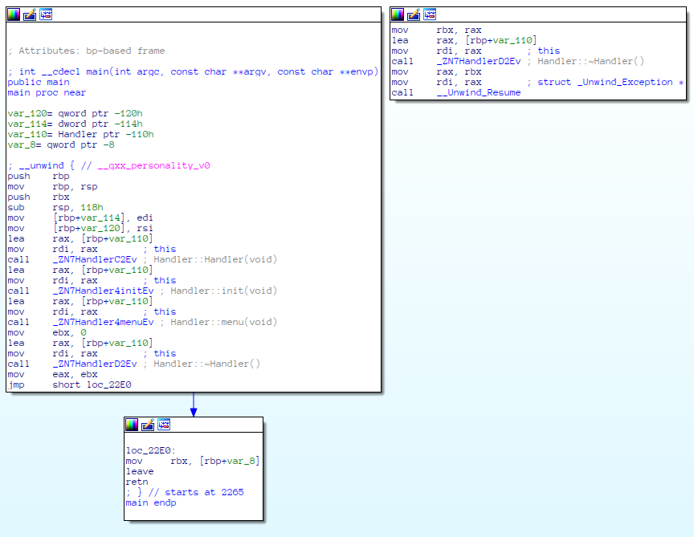
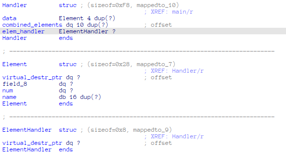
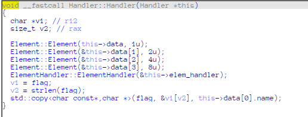
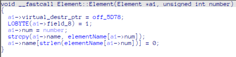
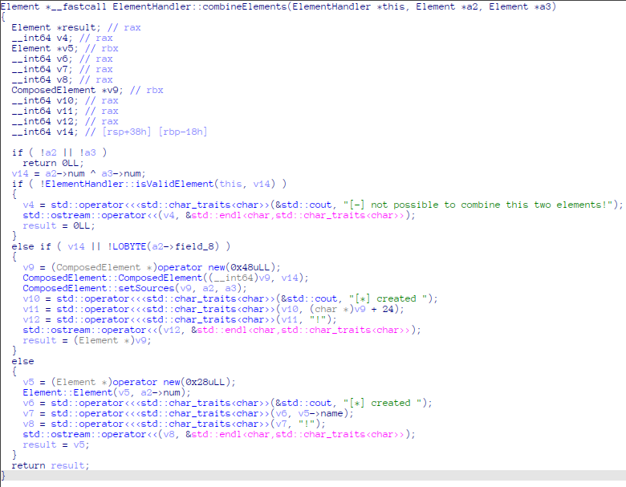
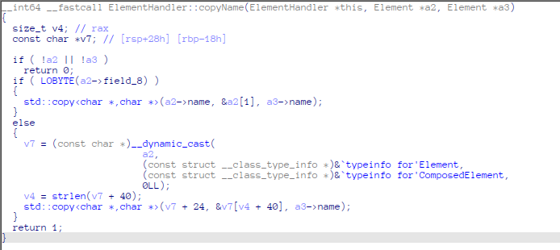
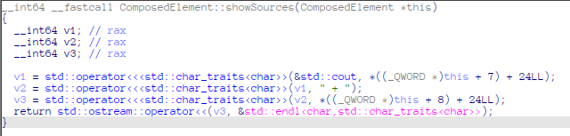
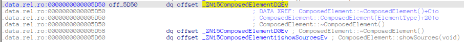

# Little Alchemy
We are given a 64 bit `ELF` file.

Open it in IDA Pro to analyze.



We can see it's C++ code with some `Handler`. Let's create structures.

Here are structures and constructors with already created structures.





As we can see flag is string in `rodata` and it's copied to the first element's name.

Let's analyze main login in `Handler::menu`.

We have 6 options as we can see after running binary:
```
Operations: [1]->Create_element [2]->Print_element [3]->Print_all [4]->Edit_element [5]->Delete_element [6]->Copy_name [7]->Exit
>
```

We need 4 of them: `create`, `edit`, `copy name` and `delete`.

As we can see with `create` can create `Element` if we try to combine element with itself of `ComposedElement`.



`ComposedElement` is derived from `Element` and it has virtual destructor, which it potential attack vector if me manage to override it.

Now let's check `Edit`:
```C
__int64 __fastcall Element::customizeName(Element *this)
{
  return std::operator>><char,std::char_traits<char>>(&std::cin, this->name);
}
```
It just reads new name without checking length. So we have heap overflow and can override virtual functions table of next element. But `cin` last byte to 0. We can try to run exploit ~256 times, but also we can use `copy` to avoid this 0 byte.

`Copy` looks pretty simple:


Interesting part is `else` where we copy from `ComposedElement`. It copies whole name until 0 byte, so we can copy more than 16 bytes.

It allows us to edit overflow `ComposedElement`'s name and then copy it without 0 byte.

To get flag we can use `ComposedElement::showSources`. This function shows parents' names. So if we call it on element with parent `-1` it will print it's name (which is flag). This function is never called but this is presented in virtual functions table. 

So if we overrate virtual functions pointer in such way destructor points to this function, it will be called when we delete object.



So exploit:
1) Create default element
2) Create composed element with `-1` (`water`) as one parent
3) Create second composed element to overflow name

Using `gdb` we can see that we need 24 bytes padding (using search-pattern to search names in heap for example).

Let's have a look how virtual destructor is called:
```C
if ( v15 )
    (*((void (__fastcall **)(Element *))v15->virtual_destr_ptr + 1))(v15);
```

We add 1 (8 bytes) to pointer to virtual destructor (I have no idea why) then dereference and call.

Initially this pointer points to `off_5D50`:


So we need to change last byte to `0x58`. We can do it with name `AAAAAAAAAAAAAAAAAAAAAAAAX` = `24 * 'A' + chr(0x58)`

## Summary

1) Create `Element`
2) Create `ComposedElement` with one parent `-1`
3) Create `ComposedElement`
4) Change name of `ComposedElement` from step 3 to `AAAAAAAAAAAAAAAAAAAAAAAAX`
5) Copy it's name to first `Element`
6) Delete `ComposedElement` from step 2.

You can find exploit in [sploit.py](./sploit.py)